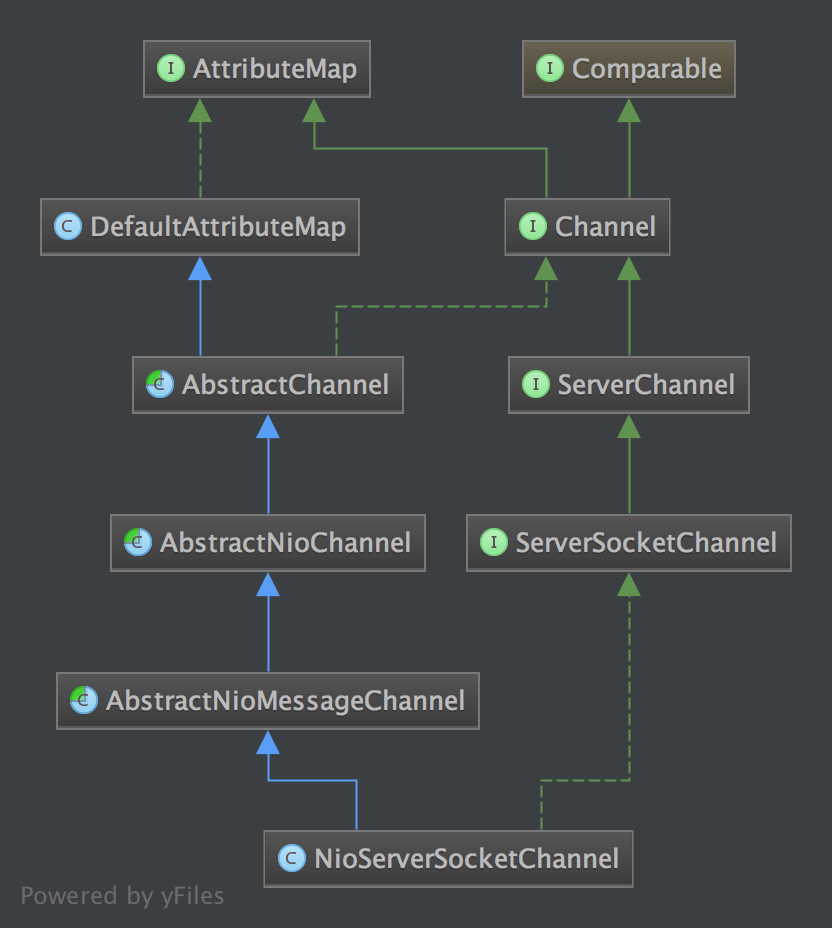
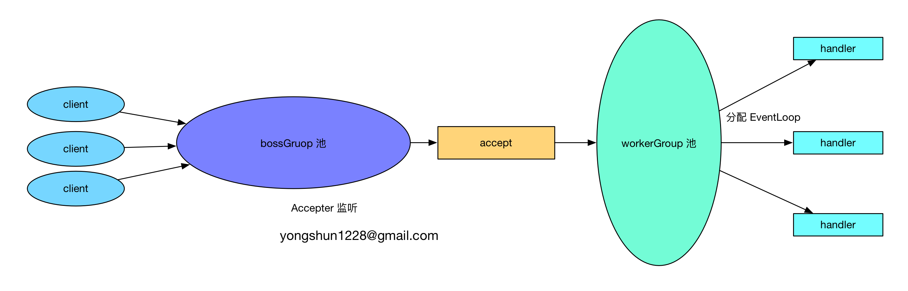
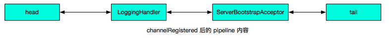
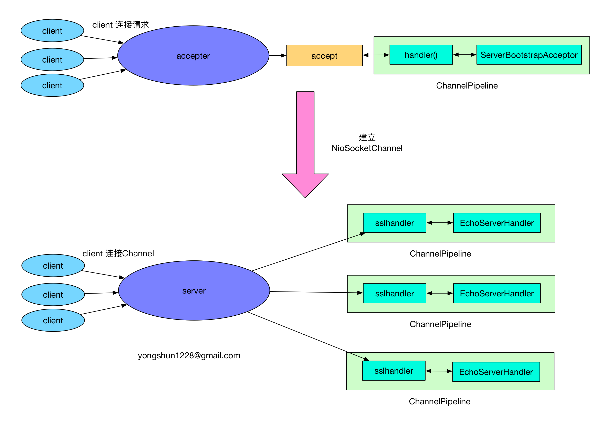

# Netty 源码分析之 一 揭开 Bootstrap 神秘的红盖头 (服务器端)
@(Netty)[Java, Netty, Netty 源码分析]

[TOC]


## 服务器端
在分析客户端的代码时, 我们已经对 Bootstrap 启动 Netty 有了一个大致的认识, 那么接下来分析服务器端时, 就会相对简单一些了.
首先还是来看一下服务器端的启动代码:
```
public final class EchoServer {

    static final boolean SSL = System.getProperty("ssl") != null;
    static final int PORT = Integer.parseInt(System.getProperty("port", "8007"));

    public static void main(String[] args) throws Exception {
        // Configure SSL.
        final SslContext sslCtx;
        if (SSL) {
            SelfSignedCertificate ssc = new SelfSignedCertificate();
            sslCtx = SslContextBuilder.forServer(ssc.certificate(), ssc.privateKey()).build();
        } else {
            sslCtx = null;
        }

        // Configure the server.
        EventLoopGroup bossGroup = new NioEventLoopGroup(1);
        EventLoopGroup workerGroup = new NioEventLoopGroup();
        try {
            ServerBootstrap b = new ServerBootstrap();
            b.group(bossGroup, workerGroup)
             .channel(NioServerSocketChannel.class)
             .option(ChannelOption.SO_BACKLOG, 100)
             .handler(new LoggingHandler(LogLevel.INFO))
             .childHandler(new ChannelInitializer<SocketChannel>() {
                 @Override
                 public void initChannel(SocketChannel ch) throws Exception {
                     ChannelPipeline p = ch.pipeline();
                     if (sslCtx != null) {
                         p.addLast(sslCtx.newHandler(ch.alloc()));
                     }
                     //p.addLast(new LoggingHandler(LogLevel.INFO));
                     p.addLast(new EchoServerHandler());
                 }
             });

            // Start the server.
            ChannelFuture f = b.bind(PORT).sync();

            // Wait until the server socket is closed.
            f.channel().closeFuture().sync();
        } finally {
            // Shut down all event loops to terminate all threads.
            bossGroup.shutdownGracefully();
            workerGroup.shutdownGracefully();
        }
    }
}
```
和客户端的代码相比, 没有很大的差别, 基本上也是进行了如下几个部分的初始化:
 1. EventLoopGroup: 不论是服务器端还是客户端, 都必须指定 EventLoopGroup. 在这个例子中, 指定了 NioEventLoopGroup, 表示一个 NIO 的EventLoopGroup, 不过服务器端需要指定两个 EventLoopGroup, 一个是 bossGroup, 用于处理客户端的连接请求; 另一个是 workerGroup, 用于处理与各个客户端连接的 IO 操作.
 2. ChannelType: 指定 Channel 的类型. 因为是服务器端, 因此使用了 NioServerSocketChannel.
 3. Handler: 设置数据的处理器.

### Channel 的初始化过程
我们在分析客户端的 Channel 初始化过程时, 已经提到, Channel 是对 Java 底层 Socket 连接的抽象, 并且知道了客户端的 Channel 的具体类型是 NioSocketChannel, 那么自然的, 服务器端的 Channel 类型就是 NioServerSocketChannel 了.
那么接下来我们按照分析客户端的流程对服务器端的代码也同样地分析一遍, 这样也方便我们对比一下服务器端和客户端有哪些不一样的地方.
#### Channel 类型的确定
同样的分析套路, 我们已经知道了, 在客户端中, Channel 的类型其实是在初始化时, 通过 Bootstrap.channel() 方法设置的, 服务器端自然也不例外.
在服务器端, 我们调用了 ServerBootstarap.channel(NioServerSocketChannel.class), 传递了一个 NioServerSocketChannel Class 对象. 这样的话, 按照和分析客户端代码一样的流程, 我们就可以确定, NioServerSocketChannel 的实例化是通过 BootstrapChannelFactory 工厂类来完成的, 而 BootstrapChannelFactory 中的 clazz 字段被设置为了 NioServerSocketChannel.class, 因此当调用 BootstrapChannelFactory.newChannel() 时:
```
@Override
public T newChannel() {
	// 删除 try 块
    return clazz.newInstance();
}
```
就获取到了一个 NioServerSocketChannel 的实例.

最后我们也来总结一下:
 - ServerBootstrap 中的 ChannelFactory 的实现是 BootstrapChannelFactory
 - 生成的 Channel 的具体类型是 NioServerSocketChannel. 
Channel 的实例化过程, 其实就是调用的 ChannelFactory.newChannel 方法, 而实例化的 Channel 的具体的类型又是和在初始化 ServerBootstrap 时传入的 channel() 方法的参数相关. 因此对于我们这个例子中的服务器端的 ServerBootstrap 而言, 生成的的 Channel 实例就是 NioServerSocketChannel.

#### NioServerSocketChannel 的实例化过程
首先还是来看一下 NioServerSocketChannel 的实例化过程.
下面是 NioServerSocketChannel 的类层次结构图:


首先, 我们来看一下它的默认的构造器. 和 NioSocketChannel 类似, 构造器都是调用了 newSocket 来打开一个 Java 的 NIO Socket, 不过需要注意的是, 客户端的 newSocket  调用的是 openSocketChannel, 而服务器端的 newSocket 调用的是 openServerSocketChannel. 顾名思义, 一个是客户端的 Java SocketChannel, 一个是服务器端的 Java ServerSocketChannel.
```
private static ServerSocketChannel newSocket(SelectorProvider provider) {
    return provider.openServerSocketChannel();
}

public NioServerSocketChannel() {
    this(newSocket(DEFAULT_SELECTOR_PROVIDER));
}
```
接下来会调用重载的构造器:
```
public NioServerSocketChannel(ServerSocketChannel channel) {
    super(null, channel, SelectionKey.OP_ACCEPT);
    config = new NioServerSocketChannelConfig(this, javaChannel().socket());
}
```
这个构造其中, 调用父类构造器时, 传入的参数是 **SelectionKey.OP_ACCEPT**. 作为对比, 我们回想一下, 在客户端的 Channel 初始化时, 传入的参数是 **SelectionKey.OP_READ**. 有 Java NIO Socket 开发经验的朋友就知道了, Java NIO 是一种 Reactor 模式, 我们通过 selector 来实现 I/O 的多路复用复用. 在一开始时, 服务器端需要监听客户端的连接请求, 因此在这里我们设置了 **SelectionKey.OP_ACCEPT**, 即通知 selector 我们对客户端的连接请求感兴趣.

接着和客户端的分析一下, 会逐级地调用父类的构造器 NioServerSocketChannel <- AbstractNioMessageChannel <- AbstractNioChannel <- AbstractChannel.
同样的, 在 AbstractChannel 中会实例化一个 unsafe 和 pipeline:
```
protected AbstractChannel(Channel parent) {
    this.parent = parent;
    unsafe = newUnsafe();
    pipeline = new DefaultChannelPipeline(this);
}
```
不过, 这里有一点需要注意的是, 客户端的 unsafe 是一个 AbstractNioByteChannel#NioByteUnsafe 的实例, 而在服务器端时, 因为 AbstractNioMessageChannel 重写了newUnsafe 方法:
```
@Override
protected AbstractNioUnsafe newUnsafe() {
    return new NioMessageUnsafe();
}
```
因此在服务器端, unsafe 字段其实是一个 AbstractNioMessageChannel#AbstractNioUnsafe 的实例.
我们来总结一下, 在  NioServerSocketChannsl 实例化过程中, 所需要做的工作:
 - 调用 NioServerSocketChannel.newSocket(DEFAULT_SELECTOR_PROVIDER) 打开一个新的 Java NIO ServerSocketChannel
 - AbstractChannel(Channel parent) 中初始化 AbstractChannel 的属性: 
  - parent 属性置为 null
  - unsafe 通过newUnsafe() 实例化一个 unsafe 对象, 它的类型是 AbstractNioMessageChannel#AbstractNioUnsafe 内部类
  - pipeline 是 new DefaultChannelPipeline(this) 新创建的实例.
 - AbstractNioChannel 中的属性:
  - SelectableChannel ch 被设置为 Java ServerSocketChannel, 即 NioServerSocketChannel#newSocket 返回的 Java NIO ServerSocketChannel.
  - readInterestOp 被设置为 SelectionKey.OP_ACCEPT
  - SelectableChannel ch 被配置为非阻塞的 **ch.configureBlocking(false)**
 - NioServerSocketChannel 中的属性:
  - ServerSocketChannelConfig config = new NioServerSocketChannelConfig(this, javaChannel().socket())

### ChannelPipeline 初始化
服务器端和客户端的 ChannelPipeline 的初始化一致, 因此就不再单独分析了.
### Channel 的注册
服务器端和客户端的 Channel 的注册过程一致, 因此就不再单独分析了.
### 关于 bossGroup 与 workerGroup
在客户端的时候, 我们只提供了一个 EventLoopGroup 对象, 而在服务器端的初始化时, 我们设置了两个 EventLoopGroup, 一个是 bossGroup, 另一个是 workerGroup. 那么这两个 EventLoopGroup 都是干什么用的呢? 其实呢, bossGroup 是用于服务端 的 accept 的, 即用于处理客户端的连接请求. 我们可以把 Netty 比作一个饭店, bossGroup 就像一个像一个前台接待, 当客户来到饭店吃时, 接待员就会引导顾客就坐, 为顾客端茶送水等. 而 workerGroup, 其实就是实际上干活的啦, 它们负责客户端连接通道的 IO 操作: 当接待员 招待好顾客后, 就可以稍做休息, 而此时后厨里的厨师们(workerGroup)就开始忙碌地准备饭菜了.
关于 bossGroup 与 workerGroup 的关系, 我们可以用如下图来展示:


首先, 服务器端 bossGroup 不断地监听是否有客户端的连接, 当发现有一个新的客户端连接到来时, bossGroup 就会为此连接初始化各项资源, 然后从 workerGroup 中选出一个 EventLoop 绑定到此客户端连接中. 那么接下来的服务器与客户端的交互过程就全部在此分配的 EventLoop 中了.

口说无凭, 我们还是以源码说话吧.
首先在ServerBootstrap 初始化时, 调用了 **b.group(bossGroup, workerGroup)** 设置了两个 EventLoopGroup, 我们跟踪进去看一下:
```
public ServerBootstrap group(EventLoopGroup parentGroup, EventLoopGroup childGroup) {
    super.group(parentGroup);
    ...
    this.childGroup = childGroup;
    return this;
}
```
显然, 这个方法初始化了两个字段, 一个是 **group = parentGroup**, 它是在 super.group(parentGroup) 中初始化的, 另一个是 **childGroup = childGroup**. 接着我们启动程序调用了 b.bind 方法来监听一个本地端口. bind 方法会触发如下的调用链:
```
AbstractBootstrap.bind -> AbstractBootstrap.doBind -> AbstractBootstrap.initAndRegister
```
AbstractBootstrap.initAndRegister 是我们的老朋友了, 我们在分析客户端程序时, 和它打过很多交到了, 我们再来回顾一下这个方法吧:
```
final ChannelFuture initAndRegister() {
    final Channel channel = channelFactory().newChannel();
    ... 省略异常判断
    init(channel);
    ChannelFuture regFuture = group().register(channel);
    return regFuture;
}
```
这里 group() 方法返回的是上面我们提到的 bossGroup, 而这里的 channel 我们也已经分析过了, 它是一个是一个 NioServerSocketChannsl 实例, 因此我们可以知道, group().register(channel) 将 bossGroup 和 NioServerSocketChannsl 关联起来了.
那么 workerGroup 是在哪里与 NioSocketChannel 关联的呢?
我们继续看 **init(channel)** 方法:
```
@Override
void init(Channel channel) throws Exception {
    ...
    ChannelPipeline p = channel.pipeline();

    final EventLoopGroup currentChildGroup = childGroup;
    final ChannelHandler currentChildHandler = childHandler;
    final Entry<ChannelOption<?>, Object>[] currentChildOptions;
    final Entry<AttributeKey<?>, Object>[] currentChildAttrs;

    p.addLast(new ChannelInitializer<Channel>() {
        @Override
        public void initChannel(Channel ch) throws Exception {
            ChannelPipeline pipeline = ch.pipeline();
            ChannelHandler handler = handler();
            if (handler != null) {
                pipeline.addLast(handler);
            }
            pipeline.addLast(new ServerBootstrapAcceptor(
                    currentChildGroup, currentChildHandler, currentChildOptions, currentChildAttrs));
        }
    });
}
```
init 方法在 ServerBootstrap 中重写了, 从上面的代码片段中我们看到, 它为 pipeline 中添加了一个 ChannelInitializer, 而这个 ChannelInitializer 中添加了一个关键的 **ServerBootstrapAcceptor** handler. 关于 handler 的添加与初始化的过程, 我们留待下一小节中分析, 我们现在关注一下 ServerBootstrapAcceptor 类.
ServerBootstrapAcceptor 中重写了 channelRead 方法, 其主要代码如下:
```
@Override
@SuppressWarnings("unchecked")
public void channelRead(ChannelHandlerContext ctx, Object msg) {
    final Channel child = (Channel) msg;
    child.pipeline().addLast(childHandler);
    ...
    childGroup.register(child).addListener(...);
}
```
ServerBootstrapAcceptor 中的 childGroup 是构造此对象是传入的 currentChildGroup, 即我们的 workerGroup, 而 Channel 是一个 NioSocketChannel 的实例, 因此这里的 childGroup.register 就是将 workerGroup 中的摸个 EventLoop 和 NioSocketChannel 关联了. 既然这样, 那么现在的问题是, ServerBootstrapAcceptor.channelRead 方法是怎么被调用的呢? 其实当一个 client 连接到 server 时, Java 底层的 NIO ServerSocketChannel 会有一个 **SelectionKey.OP_ACCEPT** 就绪事件, 接着就会调用到 NioServerSocketChannel.doReadMessages:
```
@Override
protected int doReadMessages(List<Object> buf) throws Exception {
    SocketChannel ch = javaChannel().accept();
    ... 省略异常处理
    buf.add(new NioSocketChannel(this, ch));
    return 1;
}
```
在 doReadMessages 中, 通过 javaChannel().accept() 获取到客户端新连接的 SocketChannel, 接着就实例化一个 **NioSocketChannel**, 并且传入 NioServerSocketChannel 对象(即 this), 由此可知, 我们创建的这个 NioSocketChannel 的父 Channel 就是 NioServerSocketChannel 实例 .
接下来就经由 Netty 的 ChannelPipeline 机制, 将读取事件逐级发送到各个 handler 中, 于是就会触发前面我们提到的 ServerBootstrapAcceptor.channelRead 方法啦.
### handler 的添加过程
服务器端的 handler 的添加过程和客户端的有点区别, 和 EventLoopGroup 一样, 服务器端的 handler 也有两个, 一个是通过 handler() 方法设置 handler 字段, 另一个是通过 childHandler() 设置 childHandler 字段. 通过前面的 bossGroup 和 workerGroup 的分析, 其实我们在这里可以大胆地猜测: handler 字段与 accept 过程有关, 即这个 handler 负责处理客户端的连接请求; 而 childHandler 就是负责和客户端的连接的 IO 交互.
那么实际上是不是这样的呢? 来, 我们继续通过代码证明.

在 **关于 bossGroup 与 workerGroup** 小节中, 我们提到, ServerBootstrap 重写了 init 方法, 在这个方法中添加了 handler:
```
@Override
void init(Channel channel) throws Exception {
    ...
    ChannelPipeline p = channel.pipeline();

    final EventLoopGroup currentChildGroup = childGroup;
    final ChannelHandler currentChildHandler = childHandler;
    final Entry<ChannelOption<?>, Object>[] currentChildOptions;
    final Entry<AttributeKey<?>, Object>[] currentChildAttrs;

    p.addLast(new ChannelInitializer<Channel>() {
        @Override
        public void initChannel(Channel ch) throws Exception {
            ChannelPipeline pipeline = ch.pipeline();
            ChannelHandler handler = handler();
            if (handler != null) {
                pipeline.addLast(handler);
            }
            pipeline.addLast(new ServerBootstrapAcceptor(
                    currentChildGroup, currentChildHandler, currentChildOptions, currentChildAttrs));
        }
    });
}
```
上面代码的 **initChannel** 方法中, 首先通过 handler() 方法获取一个 handler, 如果获取的 handler 不为空,则添加到 pipeline 中. 然后接着, 添加了一个 ServerBootstrapAcceptor 实例. 那么这里 handler() 方法返回的是哪个对象呢? 其实它返回的是 handler 字段, 而这个字段就是我们在服务器端的启动代码中设置的:
```
b.group(bossGroup, workerGroup)
 ...
 .handler(new LoggingHandler(LogLevel.INFO))
```
那么这个时候, pipeline 中的 handler 情况如下:


根据我们原来分析客户端的经验, 我们指定, 当 channel 绑定到 eventLoop 后(在这里是 NioServerSocketChannel 绑定到 bossGroup)中时, 会在 pipeline 中发出 **fireChannelRegistered** 事件, 接着就会触发 ChannelInitializer.initChannel 方法的调用.
因此在绑定完成后, 此时的 pipeline 的内如如下:


前面我们在分析 bossGroup 和 workerGroup 时, 已经知道了在 ServerBootstrapAcceptor.channelRead 中会为新建的 Channel 设置 handler 并注册到一个 eventLoop 中, 即:
```
@Override
@SuppressWarnings("unchecked")
public void channelRead(ChannelHandlerContext ctx, Object msg) {
    final Channel child = (Channel) msg;
    child.pipeline().addLast(childHandler);
    ...
    childGroup.register(child).addListener(...);
}
```
而这里的 childHandler 就是我们在服务器端启动代码中设置的 handler:
```
b.group(bossGroup, workerGroup)
 ...
 .childHandler(new ChannelInitializer<SocketChannel>() {
     @Override
     public void initChannel(SocketChannel ch) throws Exception {
         ChannelPipeline p = ch.pipeline();
         if (sslCtx != null) {
             p.addLast(sslCtx.newHandler(ch.alloc()));
         }
         //p.addLast(new LoggingHandler(LogLevel.INFO));
         p.addLast(new EchoServerHandler());
     }
 });
```
后续的步骤就没有什么好说的了, 当这个客户端连接 Channel 注册后, 就会触发 ChannelInitializer.initChannel 方法的调用, 此后的客户端的 ChannelPipeline 状态如下:


最后我们来总结一下服务器端的 handler 与 childHandler 的区别与联系:
 - 在服务器 NioServerSocketChannel 的 pipeline 中添加的是 handler 与 ServerBootstrapAcceptor.
 - 当有新的客户端连接请求时, ServerBootstrapAcceptor.channelRead 中负责新建此连接的 NioSocketChannel 并添加 childHandler 到 NioSocketChannel 对应的 pipeline 中, 并将此 channel 绑定到 workerGroup 中的某个 eventLoop 中.
 - handler 是在 accept 阶段起作用, 它处理客户端的连接请求.
 - childHandler 是在客户端连接建立以后起作用, 它负责客户端连接的 IO 交互.

下面我们用一幅图来总结一下服务器端的 handler 添加流程:


## 后记
这是 **Netty 源码分析** 系列教程的第一篇, 按我的计划, 这一篇文章是一个简述性质的, 即这里会涉及到 Netty 各个功能模块, 但是我只是简单地提了一下, 而没有深入地探索它们内部的实现机理. 之所以这样做, 第一, 是因为如果一上来就从细节分析, 那么未免会陷入各种琐碎的细节中难以自拔; 第二, 我想给读者展示一个一个完整的 Netty 的运行流程, 让读者从一个整体上对 Netty 有一个感性的认识.
此篇文章涉及的模块比较多, 面比较广, 因此写起来难免有一点跳跃, 并且我感觉写着写着见见有点不知所云, 逻辑混乱了, 汗. 唉, 还是感觉自己功力不够, hold 不住.
接下来的几篇文章, 我会根据 Netty 的各个模块深入分析一下, 希望以后的文章能够组织的调理更加清晰一些.