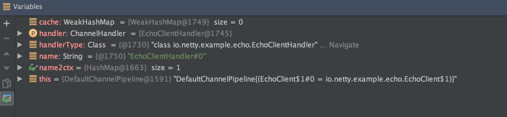
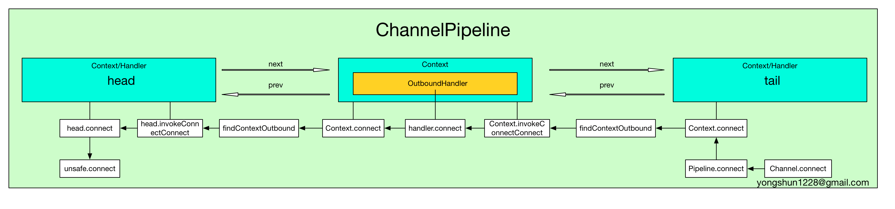
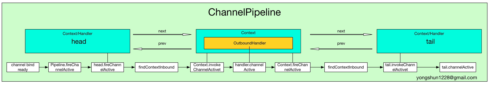

# Netty 源码分析之 二 贯穿Netty 的大动脉 ── ChannelPipeline (二)

@(Netty)[Netty 源码分析]

[TOC]


----------
接上篇 **Netty 源码分析之 二 贯穿Netty 的大动脉 ── ChannelPipeline (一)**
## ChannelHandler 的名字
我们注意到, pipeline.addXXX 都有一个重载的方法, 例如 addLast, 它有一个重载的版本是:
```
ChannelPipeline addLast(String name, ChannelHandler handler);
```
第一个参数指定了所添加的 handler 的名字(更准确地说是 ChannelHandlerContext 的名字, 不过我们通常是以 handler 作为叙述的对象, 因此说成 handler 的名字便于理解). 那么 handler 的名字有什么用呢? 如果我们不设置name, 那么 handler 会有怎样的名字?
为了解答这些疑惑, 老规矩, 依然是从源码中找到答案.
我们还是以 addLast 方法为例:
```
@Override
public ChannelPipeline addLast(String name, ChannelHandler handler) {
    return addLast(null, name, handler);
}
```
这个方法会调用重载的 addLast 方法:
```
@Override
public ChannelPipeline addLast(EventExecutorGroup group, final String name, ChannelHandler handler) {
    synchronized (this) {
        checkDuplicateName(name);

        AbstractChannelHandlerContext newCtx = new DefaultChannelHandlerContext(this, group, name, handler);
        addLast0(name, newCtx);
    }

    return this;
}
```
第一个参数被设置为 null, 我们不关系它. 第二参数就是这个 handler 的名字. 看代码可知, 在添加一个 handler 之前, 需要调用 **checkDuplicateName** 方法来确定此 handler 的名字是否和已添加的 handler 的名字重复. 而这个 checkDuplicateName 方法我们在前面已经有提到, 这里再回顾一下:
```
private void checkDuplicateName(String name) {
    if (name2ctx.containsKey(name)) {
        throw new IllegalArgumentException("Duplicate handler name: " + name);
    }
}
```
Netty 判断一个 handler 的名字是否重复的依据很简单: DefaultChannelPipeline 中有一个 类型为 Map<String, AbstractChannelHandlerContext> 的 **name2ctx** 字段, 它的 key 是一个 handler 的名字, 而 value 则是这个 handler 所对应的 ChannelHandlerContext. 每当新添加一个 handler 时, 就会 put 到 name2ctx 中. 因此检查 name2ctx 中是否包含这个 name 即可.
当没有重名的 handler 时, 就为这个 handler 生成一个关联的 DefaultChannelHandlerContext 对象, 然后就将 name 和 newCtx 作为 key-value 对 放到 name2Ctx 中.

### 自动生成 handler 的名字
如果我们调用的是如下的 addLast 方法
```
ChannelPipeline addLast(ChannelHandler... handlers);
```
那么 Netty 会调用 generateName 为我们的 handler 自动生成一个名字:
```
private String generateName(ChannelHandler handler) {
    WeakHashMap<Class<?>, String> cache = nameCaches[(int) (Thread.currentThread().getId() % nameCaches.length)];
    Class<?> handlerType = handler.getClass();
    String name;
    synchronized (cache) {
        name = cache.get(handlerType);
        if (name == null) {
            name = generateName0(handlerType);
            cache.put(handlerType, name);
        }
    }

    synchronized (this) {
        // It's not very likely for a user to put more than one handler of the same type, but make sure to avoid
        // any name conflicts.  Note that we don't cache the names generated here.
        if (name2ctx.containsKey(name)) {
            String baseName = name.substring(0, name.length() - 1); // Strip the trailing '0'.
            for (int i = 1;; i ++) {
                String newName = baseName + i;
                if (!name2ctx.containsKey(newName)) {
                    name = newName;
                    break;
                }
            }
        }
    }

    return name;
}
```
而 generateName 会接着调用  **generateName0** 来实际产生一个 handler 的名字:
```
private static String generateName0(Class<?> handlerType) {
    return StringUtil.simpleClassName(handlerType) + "#0";
}
```
自动生成的名字的规则很简单, 就是 handler 的简单类名加上 "#0", 因此我们的 EchoClientHandler 的名字就是 "EchoClientHandler#0", 这一点也可以通过调试窗口佐证:


## 关于 Pipeline 的事件传输机制
前面章节中, 我们知道  AbstractChannelHandlerContext 中有 inbound 和 outbound 两个 boolean 变量, 分别用于标识 Context 所对应的 handler 的类型, 即:
 - inbound 为真时, 表示对应的 ChannelHandler 实现了 ChannelInboundHandler 方法.
 - outbound 为真时, 表示对应的 ChannelHandler 实现了 ChannelOutboundHandler 方法.

读者朋友肯定很疑惑了吧: 那究竟这两个字段有什么作用呢? 其实这还要从 ChannelPipeline 的传输的事件类型说起.
**Netty 的事件可以分为 Inbound 和 Outbound 事件.**

如下是从 Netty 官网上拷贝的一个图示:
```
                                             I/O Request
                                        via Channel or
                                    ChannelHandlerContext
                                                  |
+---------------------------------------------------+---------------+
|                           ChannelPipeline         |               |
|                                                  \|/              |
|    +---------------------+            +-----------+----------+    |
|    | Inbound Handler  N  |            | Outbound Handler  1  |    |
|    +----------+----------+            +-----------+----------+    |
|              /|\                                  |               |
|               |                                  \|/              |
|    +----------+----------+            +-----------+----------+    |
|    | Inbound Handler N-1 |            | Outbound Handler  2  |    |
|    +----------+----------+            +-----------+----------+    |
|              /|\                                  .               |
|               .                                   .               |
| ChannelHandlerContext.fireIN_EVT() ChannelHandlerContext.OUT_EVT()|
|        [ method call]                       [method call]         |
|               .                                   .               |
|               .                                  \|/              |
|    +----------+----------+            +-----------+----------+    |
|    | Inbound Handler  2  |            | Outbound Handler M-1 |    |
|    +----------+----------+            +-----------+----------+    |
|              /|\                                  |               |
|               |                                  \|/              |
|    +----------+----------+            +-----------+----------+    |
|    | Inbound Handler  1  |            | Outbound Handler  M  |    |
|    +----------+----------+            +-----------+----------+    |
|              /|\                                  |               |
+---------------+-----------------------------------+---------------+
              |                                  \|/
+---------------+-----------------------------------+---------------+
|               |                                   |               |
|       [ Socket.read() ]                    [ Socket.write() ]     |
|                                                                   |
|  Netty Internal I/O Threads (Transport Implementation)            |
+-------------------------------------------------------------------+
```
从上图可以看出, inbound 事件和 outbound 事件的流向是不一样的, inbound 事件的流行是从下至上, 而 outbound 刚好相反, 是从上到下. 并且 inbound 的传递方式是通过调用相应的 **ChannelHandlerContext.fireIN_EVT()** 方法, 而 outbound 方法的的传递方式是通过调用 **ChannelHandlerContext.OUT_EVT()** 方法. 例如 **ChannelHandlerContext.fireChannelRegistered()** 调用会发送一个 **ChannelRegistered** 的 inbound 给下一个ChannelHandlerContext, 而 **ChannelHandlerContext.bind** 调用会发送一个 **bind** 的 outbound 事件给 下一个 ChannelHandlerContext.

Inbound 事件传播方法有:
```
ChannelHandlerContext.fireChannelRegistered()
ChannelHandlerContext.fireChannelActive()
ChannelHandlerContext.fireChannelRead(Object)
ChannelHandlerContext.fireChannelReadComplete()
ChannelHandlerContext.fireExceptionCaught(Throwable)
ChannelHandlerContext.fireUserEventTriggered(Object)
ChannelHandlerContext.fireChannelWritabilityChanged()
ChannelHandlerContext.fireChannelInactive()
ChannelHandlerContext.fireChannelUnregistered()
```
Oubound 事件传输方法有:
```
ChannelHandlerContext.bind(SocketAddress, ChannelPromise)
ChannelHandlerContext.connect(SocketAddress, SocketAddress, ChannelPromise)
ChannelHandlerContext.write(Object, ChannelPromise)
ChannelHandlerContext.flush()
ChannelHandlerContext.read()
ChannelHandlerContext.disconnect(ChannelPromise)
ChannelHandlerContext.close(ChannelPromise)
```
`注意, 如果我们捕获了一个事件, 并且想让这个事件继续传递下去, 那么需要调用 Context 相应的传播方法.`
例如:
```
public class MyInboundHandler extends ChannelInboundHandlerAdapter {
    @Override
    public void channelActive(ChannelHandlerContext ctx) {
        System.out.println("Connected!");
        ctx.fireChannelActive();
    }
}

public clas MyOutboundHandler extends ChannelOutboundHandlerAdapter {
    @Override
    public void close(ChannelHandlerContext ctx, ChannelPromise promise) {
        System.out.println("Closing ..");
        ctx.close(promise);
    }
}
```
上面的例子中, MyInboundHandler 收到了一个 channelActive 事件, 它在处理后, 如果希望将事件继续传播下去, 那么需要接着调用 ctx.fireChannelActive().

### Outbound 操作(outbound operations of a channel)
`Outbound 事件都是请求事件(request event)`, 即请求某件事情的发生, 然后通过 Outbound 事件进行通知.
Outbound 事件的传播方向是 tail -> customContext -> head.

我们接下来以 connect 事件为例, 分析一下 Outbound 事件的传播机制.
首先, 当用户调用了 Bootstrap.connect 方法时, 就会触发一个 **Connect 请求事件**, 此调用会触发如下调用链:
```
Bootstrap.connect -> Bootstrap.doConnect -> Bootstrap.doConnect0 -> AbstractChannel.connect
```
继续跟踪的话, 我们就发现, AbstractChannel.connect 其实由调用了 DefaultChannelPipeline.connect 方法:
```
@Override
public ChannelFuture connect(SocketAddress remoteAddress, ChannelPromise promise) {
	return pipeline.connect(remoteAddress, promise);
}
```
而 pipeline.connect 的实现如下:
```
@Override
public ChannelFuture connect(SocketAddress remoteAddress, ChannelPromise promise) {
    return tail.connect(remoteAddress, promise);
}
```
可以看到, 当 outbound 事件(这里是 connect 事件)传递到 Pipeline 后, 它其实是以 tail 为起点开始传播的.
而 tail.connect 其实调用的是 AbstractChannelHandlerContext.connect 方法:
```
@Override
public ChannelFuture connect(
        final SocketAddress remoteAddress, final SocketAddress localAddress, final ChannelPromise promise) {
    ...
    final AbstractChannelHandlerContext next = findContextOutbound();
    EventExecutor executor = next.executor();
    ...
    next.invokeConnect(remoteAddress, localAddress, promise);
    ...
    return promise;
}
```
findContextOutbound() 顾名思义, 它的作用是以当前 Context 为起点, 向 Pipeline 中的 Context 双向链表的前端寻找第一个 **outbound** 属性为真的 Context(即关联着 ChannelOutboundHandler 的 Context), 然后返回.
它的实现如下:
```
private AbstractChannelHandlerContext findContextOutbound() {
    AbstractChannelHandlerContext ctx = this;
    do {
        ctx = ctx.prev;
    } while (!ctx.outbound);
    return ctx;
}
```
当我们找到了一个 outbound 的 Context 后, 就调用它的 invokeConnect 方法, 这个方法中会调用 Context 所关联着的 ChannelHandler 的 connect 方法:
```
private void invokeConnect(SocketAddress remoteAddress, SocketAddress localAddress, ChannelPromise promise) {
    try {
        ((ChannelOutboundHandler) handler()).connect(this, remoteAddress, localAddress, promise);
    } catch (Throwable t) {
        notifyOutboundHandlerException(t, promise);
    }
}
```
如果用户没有重写 ChannelHandler 的 connect 方法, 那么会调用 ChannelOutboundHandlerAdapter 所实现的方法:
```
@Override
public void connect(ChannelHandlerContext ctx, SocketAddress remoteAddress,
        SocketAddress localAddress, ChannelPromise promise) throws Exception {
    ctx.connect(remoteAddress, localAddress, promise);
}
```
我们看到, ChannelOutboundHandlerAdapter.connect 仅仅调用了 ctx.connect, 而这个调用又回到了:
```
Context.connect -> Connect.findContextOutbound -> next.invokeConnect -> handler.connect -> Context.connect
```
这样的循环中, 直到 connect 事件传递到DefaultChannelPipeline 的双向链表的头节点, 即 head 中. 为什么会传递到 head 中呢? 回想一下, head 实现了 ChannelOutboundHandler, 因此它的 outbound 属性是 true.
`因为 head 本身既是一个 ChannelHandlerContext, 又实现了 ChannelOutboundHandler 接口`, 因此当 connect 消息传递到 head 后, 会将消息转递到对应的 ChannelHandler 中处理, 而恰好, head 的 handler() 返回的就是 head 本身:
```
@Override
public ChannelHandler handler() {
    return this;
}
```
因此最终 connect 事件是在 head 中处理的. head 的 connect 事件处理方法如下:
```
@Override
public void connect(
        ChannelHandlerContext ctx,
        SocketAddress remoteAddress, SocketAddress localAddress,
        ChannelPromise promise) throws Exception {
    unsafe.connect(remoteAddress, localAddress, promise);
}
```
到这里, 整个 Connect 请求事件就结束了.
下面以一幅图来描述一个整个 Connect 请求事件的处理过程:



我们仅仅以 Connect 请求事件为例, 分析了 Outbound 事件的传播过程, 但是其实所有的 outbound 的事件传播都遵循着一样的传播规律, 读者可以试着分析一下其他的 outbound 事件, 体会一下它们的传播过程.

### Inbound 事件
Inbound 事件和 Outbound 事件的处理过程有点镜像.
`Inbound 事件是一个通知事件`, 即某件事已经发生了, 然后通过 Inbound 事件进行通知. Inbound 通常发生在 Channel 的状态的改变或 IO 事件就绪.
Inbound 的特点是它传播方向是 head -> customContext -> tail.

既然上面我们分析了 Connect 这个 Outbound 事件, 那么接着分析 Connect 事件后会发生什么 Inbound 事件, 并最终找到 Outbound 和 Inbound 事件之间的联系.

当 Connect 这个 Outbound 传播到 unsafe 后, 其实是在 AbstractNioUnsafe.connect 方法中进行处理的:
```
@Override
public final void connect(
        final SocketAddress remoteAddress, final SocketAddress localAddress, final ChannelPromise promise) {
    ...
    if (doConnect(remoteAddress, localAddress)) {
        fulfillConnectPromise(promise, wasActive);
    } else {
        ...
    }
    ...
}
```
在 AbstractNioUnsafe.connect 中, 首先调用 doConnect 方法进行实际上的 Socket 连接, 当连接上后, 会调用 fulfillConnectPromise 方法:
```
private void fulfillConnectPromise(ChannelPromise promise, boolean wasActive) {
    ...
    // Regardless if the connection attempt was cancelled, channelActive() event should be triggered,
    // because what happened is what happened.
    if (!wasActive && isActive()) {
        pipeline().fireChannelActive();
    }
    ...
}
```
我们看到, 在 fulfillConnectPromise 中, 会通过调用 pipeline().fireChannelActive() 将通道激活的消息(即 Socket 连接成功)发送出去.
`而这里, 当调用 pipeline.fireXXX 后, 就是 Inbound 事件的起点.`
因此当调用了 pipeline().fireChannelActive() 后, 就产生了一个 ChannelActive Inbound 事件, 我们就从这里开始看看这个 Inbound 事件是怎么传播的吧.
```
@Override
public ChannelPipeline fireChannelActive() {
    head.fireChannelActive();

    if (channel.config().isAutoRead()) {
        channel.read();
    }

    return this;
}
```
哈哈, 果然, 在 fireChannelActive 方法中, 调用的是 head.fireChannelActive, `因此可以证明了, Inbound 事件在 Pipeline 中传输的起点是 head.`
那么, 在 head.fireChannelActive() 中又做了什么呢?
```
@Override
public ChannelHandlerContext fireChannelActive() {
    final AbstractChannelHandlerContext next = findContextInbound();
    EventExecutor executor = next.executor();
    ...
    next.invokeChannelActive();
    ...
    return this;
}
```
上面的代码应该很熟悉了吧. 回想一下在 Outbound 事件(例如 Connect 事件)的传输过程中时, 我们也有类似的操作:
 - 首先调用 findContextInbound, 从 Pipeline 的双向链表中中找到第一个属性 inbound 为真的 Context, 然后返回
 - 调用这个 Context 的 invokeChannelActive

invokeChannelActive 方法如下:
```
private void invokeChannelActive() {
    try {
        ((ChannelInboundHandler) handler()).channelActive(this);
    } catch (Throwable t) {
        notifyHandlerException(t);
    }
}
```
这个方法和 Outbound 的对应方法(例如 invokeConnect) 如出一辙. 同 Outbound 一样, 如果用户没有重写 channelActive 方法, 那么会调用 ChannelInboundHandlerAdapter 的 channelActive 方法:
```
@Override
public void channelActive(ChannelHandlerContext ctx) throws Exception {
    ctx.fireChannelActive();
}
```
同样地, 在 ChannelInboundHandlerAdapter.channelActive 中, 仅仅调用了 ctx.fireChannelActive 方法, 因此就会有如下循环:
```
Context.fireChannelActive -> Connect.findContextInbound -> nextContext.invokeChannelActive -> nextHandler.channelActive -> nextContext.fireChannelActive
```
这样的循环中. 同理, tail 本身 既实现了 **ChannelInboundHandler** 接口, 又实现了 **ChannelHandlerContext** 接口, 因此当 channelActive 消息传递到 tail 后, 会将消息转递到对应的 ChannelHandler 中处理, 而恰好, tail 的 handler() 返回的就是 tail 本身:
```
@Override
public ChannelHandler handler() {
    return this;
}
```
因此 channelActive Inbound 事件最终是在 tail 中处理的, 我们看一下它的处理方法:
```
@Override
public void channelActive(ChannelHandlerContext ctx) throws Exception { }
```
TailContext.channelActive 方法是空的. 如果读者自行查看 TailContext 的 Inbound 处理方法时, 会发现, 它们的实现都是空的. 可见, 如果是 Inbound, 当用户没有实现自定义的处理器时, 那么默认是不处理的.

用一幅图来总结一下 Inbound 的传输过程吧:



### 总结
对于 Outbound事件:
 - Outbound 事件是请求事件(由 Connect 发起一个请求, 并最终由 unsafe 处理这个请求)
 - Outbound 事件的发起者是 Channel
 - Outbound 事件的处理者是 unsafe
 - Outbound 事件在 Pipeline 中的传输方向是 tail -> head.
 - 在 ChannelHandler 中处理事件时, 如果这个 Handler 不是最后一个 Hnalder, 则需要调用 ctx.xxx (例如 ctx.connect) 将此事件继续传播下去. 如果不这样做, 那么此事件的传播会提前终止.
 - Outbound 事件流: Context.OUT_EVT -> Connect.findContextOutbound -> nextContext.invokeOUT_EVT -> nextHandler.OUT_EVT -> nextContext.OUT_EVT

对于 Inbound 事件:
 - Inbound 事件是通知事件, 当某件事情已经就绪后, 通知上层.
 - Inbound 事件发起者是 unsafe
 - Inbound 事件的处理者是 Channel, 如果用户没有实现自定义的处理方法, 那么Inbound 事件默认的处理者是 TailContext, 并且其处理方法是空实现.
 - Inbound  事件在 Pipeline 中传输方向是 head -> tail
 - 在 ChannelHandler 中处理事件时, 如果这个 Handler 不是最后一个 Hnalder, 则需要调用 ctx.fireIN_EVT (例如 ctx.fireChannelActive) 将此事件继续传播下去. 如果不这样做, 那么此事件的传播会提前终止.
 - Outbound 事件流: Context.fireIN_EVT -> Connect.findContextInbound -> nextContext.invokeIN_EVT -> nextHandler.IN_EVT -> nextContext.fireIN_EVT


outbound 和 inbound 事件十分的镜像, 并且 Context 与 Handler 直接的调用关系是否容易混淆, 因此读者在阅读这里的源码时, 需要特别的注意.