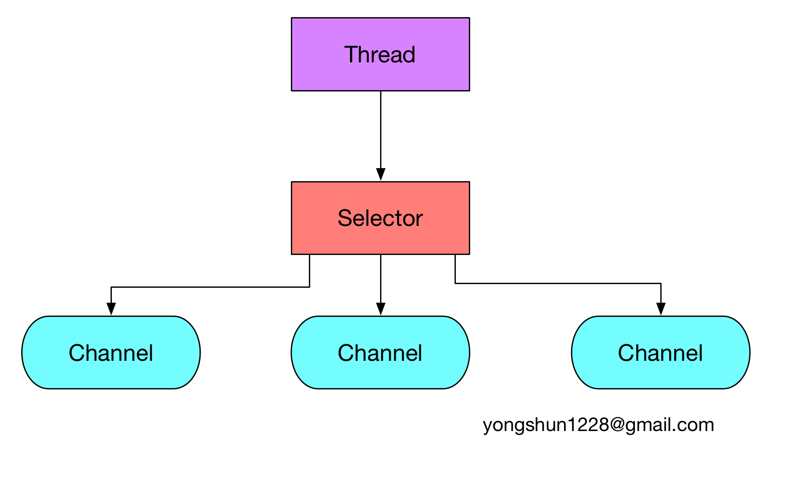

# Netty 源码分析之 番外篇 Java NIO 的前生今世
@(Netty)[Netty 源码分析, ChannelFuture, ChannelPromise]

[TOC]


----------

## 简介
Java NIO 是由 Java 1.4 引进的异步 IO.
Java NIO 由以下几个核心部分组成:
 - Channel
 - Buffer
 - Selector

### NIO 和 IO 的对比
IO 和 NIO 的区别主要体现在三个方面:
 - IO 基于流(Stream oriented), 而 NIO 基于 Buffer (Buffer oriented)
 - IO 操作是阻塞的, 而 NIO 操作是非阻塞的
 - IO 没有 selector 概念, 而 NIO 有 selector 概念.


#### 基于 Stream 与基于 Buffer
传统的 IO 是面向字节流或字符流的, 而在 NIO 中, 我们抛弃了传统的 IO 流, 而是引入了 **Channel** 和 **Buffer** 的概念. 在 NIO 中, 我只能从 Channel 中读取数据到 Buffer 中或将数据从 Buffer 中写入到 Channel.
那么什么是 **基于流** 呢? 在一般的 Java IO 操作中, 我们以流式的方式顺序地从一个 Stream 中读取一个或多个字节, 因此我们也就不能随意改变读取指针的位置.
而 **基于 Buffer** 就显得有点不同了. 我们首先需要从 Channel 中读取数据到 Buffer 中, 当 Buffer 中有数据后, 我们就可以对这些数据进行操作了. 不像 IO 那样是顺序操作, NIO 中我们可以随意地读取任意位置的数据.

#### 阻塞和非阻塞
Java 提供的各种 Stream 操作都是阻塞的, 例如我们调用一个 read 方法读取一个文件的内容, 那么调用 read 的线程会被阻塞住, 直到 read 操作完成.
而  NIO 的非阻塞模式允许我们非阻塞地进行 IO 操作. 例如我们需要从网络中读取数据, 在 NIO 的非阻塞模式中, 当我们调用 read 方法时, 如果此时有数据, 则 read 读取并返回; 如果此时没有数据, 则 read 直接返回, 而不会阻塞当前线程.
#### selector
selector 是 NIO 中才有的概念, 它是 Java NIO 之所以可以非阻塞地进行 IO 操作的关键.
通过 Selector, 一个线程可以监听多个 Channel 的 IO 事件, 当我们向一个 Selector 中注册了 Channel 后, Selector 内部的机制就可以自动地为我们不断地查询(select) 这些注册的 Channel 是否有已就绪的 IO 事件(例如可读, 可写, 网络连接完成等). 通过这样的 Selector 机制, 我们就可以很简单地使用一个线程高效地管理多个 Channel 了.

## Java NIO Channel
通常来说, 所有的 NIO 的 I/O 操作都是从 Channel 开始的. 一个 channel 类似于一个 stream.
java Stream 和 NIO Channel 对比
 - 我们可以在同一个 Channel 中执行读和写操作, 然而同一个 Stream 仅仅支持读或写.
 - Channel 可以异步地读写, 而 Stream 是阻塞的同步读写.
 - Channel 总是从 Buffer 中读取数据, 或将数据写入到 Buffer 中.


Channel 类型有:
 - FileChannel, 文件操作
 - DatagramChannel, UDP 操作
 - SocketChannel, TCP 操作
 - ServerSocketChannel, TCP 操作, 使用在服务器端.


这些通道涵盖了 UDP 和 TCP网络 IO以及文件 IO.
基本的 Channel 使用例子:
```
public static void main( String[] args ) throws Exception
{
    RandomAccessFile aFile = new RandomAccessFile("/Users/xiongyongshun/settings.xml", "rw");
    FileChannel inChannel = aFile.getChannel();

    ByteBuffer buf = ByteBuffer.allocate(48);

    int bytesRead = inChannel.read(buf);
    while (bytesRead != -1) {
        buf.flip();

        while(buf.hasRemaining()){
            System.out.print((char) buf.get());
        }

        buf.clear();
        bytesRead = inChannel.read(buf);
    }
    aFile.close();
}
```
### FileChannel
FileChannel 是操作文件的Channel, 我们可以通过 FileChannel 从一个文件中读取数据, 也可以将数据写入到文件中.
**`注意`**, FileChannel 不能设置为非阻塞模式.
#### 打开 FileChannel
```
RandomAccessFile aFile     = new RandomAccessFile("data/nio-data.txt", "rw");
FileChannel      inChannel = aFile.getChannel();
```
#### 从 FileChannel 中读取数据
```
ByteBuffer buf = ByteBuffer.allocate(48);
int bytesRead = inChannel.read(buf);
```
#### 写入数据
```
String newData = "New String to write to file..." + System.currentTimeMillis();

ByteBuffer buf = ByteBuffer.allocate(48);
buf.clear();
buf.put(newData.getBytes());

buf.flip();

while(buf.hasRemaining()) {
    channel.write(buf);
}
```
#### 关闭
当我们对 FileChannel 的操作完成后, 必须将其关闭
```
channel.close(); 
```
#### 设置 position
```
long pos channel.position();
channel.position(pos +123);
```
#### 文件大小
我们可以通过 channel.size()获取关联到这个 Channel 中的文件的大小. **注意**, 这里返回的是文件的大小, 而不是 Channel 中剩余的元素个数.
#### 截断文件
```
channel.truncate(1024);
```
将文件的大小截断为1024字节.
#### 强制写入
我们可以强制将缓存的未写入的数据写入到文件中:
```
channel.force(true);
```

### SocketChannel
SocketChannel 是一个客户端用来进行 TCP 连接的 Channel.
创建一个 SocketChannel 的方法有两种:
 - 打开一个 SocketChannel, 然后将其连接到某个服务器中
 - 当一个 ServerSocketChannel 接受到连接请求时, 会返回一个 SocketChannel 对象.
#### 打开 SocketChannel
```
SocketChannel socketChannel = SocketChannel.open();
socketChannel.connect(new InetSocketAddress("http://example.com", 80));
```
#### 关闭
```
socketChannel.close(); 
```
#### 读取数据
```
ByteBuffer buf = ByteBuffer.allocate(48);
int bytesRead = socketChannel.read(buf);
```
如果 read()返回 **-1**, 那么表示连接中断了.
#### 写入数据
```
String newData = "New String to write to file..." + System.currentTimeMillis();

ByteBuffer buf = ByteBuffer.allocate(48);
buf.clear();
buf.put(newData.getBytes());

buf.flip();

while(buf.hasRemaining()) {
    channel.write(buf);
}
```
#### 非阻塞模式
我们可以设置 SocketChannel 为异步模式, 这样我们的 connect, read, write 都是异步的了.
##### 连接
```
socketChannel.configureBlocking(false);
socketChannel.connect(new InetSocketAddress("http://example.com", 80));

while(! socketChannel.finishConnect() ){
    //wait, or do something else...    
}
```
在异步模式中, 或许连接还没有建立, connect 方法就返回了, 因此我们需要检查当前是否是连接到了主机, 因此通过一个 while 循环来判断.
##### 读写
在异步模式下, 读写的方式是一样的.
在读取时, 因为是异步的, 因此我们必须检查 read 的返回值, 来判断当前是否读取到了数据.

### ServerSocketChannel
ServerSocketChannel 顾名思义, 是用在服务器为端的, 可以监听客户端的 TCP 连接, 例如:
```
ServerSocketChannel serverSocketChannel = ServerSocketChannel.open();
serverSocketChannel.socket().bind(new InetSocketAddress(9999));
while(true){
    SocketChannel socketChannel =
            serverSocketChannel.accept();

    //do something with socketChannel...
}
```
#### 打开 关闭
```
ServerSocketChannel serverSocketChannel = ServerSocketChannel.open();
```
```
serverSocketChannel.close();
```
#### 监听连接
我们可以使用ServerSocketChannel.accept()方法来监听客户端的 TCP 连接请求, accept()方法会阻塞, 直到有连接到来, 当有连接时, 这个方法会返回一个 SocketChannel 对象:
```
while(true){
    SocketChannel socketChannel =
            serverSocketChannel.accept();

    //do something with socketChannel...
}
```
#### 非阻塞模式
在非阻塞模式下, accept()是非阻塞的, 因此如果此时没有连接到来, 那么 accept()方法会返回null:
```
ServerSocketChannel serverSocketChannel = ServerSocketChannel.open();

serverSocketChannel.socket().bind(new InetSocketAddress(9999));
serverSocketChannel.configureBlocking(false);

while(true){
    SocketChannel socketChannel =
            serverSocketChannel.accept();

    if(socketChannel != null){
        //do something with socketChannel...
        }
}
```
### DatagramChannel
DatagramChannel 是用来处理 UDP 连接的.
#### 打开
```
DatagramChannel channel = DatagramChannel.open();
channel.socket().bind(new InetSocketAddress(9999));
```
#### 读取数据
```
ByteBuffer buf = ByteBuffer.allocate(48);
buf.clear();

channel.receive(buf);
```
#### 发送数据
```
String newData = "New String to write to file..."
                    + System.currentTimeMillis();
    
ByteBuffer buf = ByteBuffer.allocate(48);
buf.clear();
buf.put(newData.getBytes());
buf.flip();

int bytesSent = channel.send(buf, new InetSocketAddress("example.com", 80));
```
#### 连接到指定地址
因为 UDP 是非连接的, 因此这个的 connect 并不是向 TCP 一样真正意义上的连接, 而是它会讲 DatagramChannel 锁住, 因此我们仅仅可以从指定的地址中读取或写入数据.
```
channel.connect(new InetSocketAddress("example.com", 80));
```

## Java NIO Buffer
当我们需要与 NIO Channel 进行交互时, 我们就需要使用到 NIO Buffer, 即数据从 Buffer读取到 Channel 中, 并且从 Channel 中写入到 Buffer 中.
实际上, 一个 Buffer 其实就是一块内存区域, 我们可以在这个内存区域中进行数据的读写. NIO Buffer 其实是这样的内存块的一个封装, 并提供了一些操作方法让我们能够方便地进行数据的读写.
Buffer 类型有:
 - ByteBuffer
 - CharBuffer
 - DoubleBuffer
 - FloatBuffer
 - IntBuffer
 - LongBuffer
 - ShortBuffer


这些 Buffer 覆盖了能从 IO 中传输的所有的 Java 基本数据类型.
### NIO Buffer 的基本使用
使用 NIO Buffer 的步骤如下:
 - 将数据写入到 Buffer 中.
 - 调用 Buffer.flip()方法, 将 NIO Buffer 转换为读模式.
 - 从 Buffer 中读取数据
 - 调用 Buffer.clear() 或 Buffer.compact()方法, 将 Buffer 转换为写模式.

当我们将数据写入到 Buffer 中时, Buffer 会记录我们已经写了多少的数据, 当我们需要从 Buffer 中读取数据时, 必须调用 Buffer.flip()将 Buffer 切换为读模式.
一旦读取了所有的 Buffer 数据, 那么我们必须清理 Buffer, 让其从新可写, 清理 Buffer 可以调用 Buffer.clear() 或 Buffer.compact().
例如:
```
public class Test {
    public static void main(String[] args) {
        IntBuffer intBuffer = IntBuffer.allocate(2);
        intBuffer.put(12345678);
        intBuffer.put(2);
        intBuffer.flip();
        System.err.println(intBuffer.get());
        System.err.println(intBuffer.get());
    }
}
```
上述中, 我们分配两个单位大小的 IntBuffer, 因此它可以写入两个 int 值.
我们使用 put 方法将 int 值写入, 然后使用 flip 方法将 buffer 转换为读模式, 然后连续使用 get 方法从 buffer 中获取这两个 int 值.
`每当调用一次 get 方法读取数据时, buffer 的读指针都会向前移动一个单位长度(在这里是一个 int 长度)`
### Buffer 属性
一个 Buffer 有三个属性:
 - capacity
 - position
 - limit


其中 **position** 和 **limit** 的含义与 Buffer 处于读模式或写模式有关, 而 capacity 的含义与 Buffer 所处的模式无关.

#### Capacity
一个内存块会有一个固定的大小, 即容量(capacity), 我们最多写入**capacity** 个单位的数据到 Buffer 中, 例如一个 DoubleBuffer, 其 Capacity 是100, 那么我们最多可以写入100个 double 数据.
#### Position
当从一个 Buffer 中写入数据时, 我们是从 Buffer 的一个确定的位置(position)开始写入的. 在最初的状态时, position 的值是0. 每当我们写入了一个单位的数据后, position 就会递增一.
当我们从 Buffer 中读取数据时, 我们也是从某个特定的位置开始读取的. **当我们调用了 filp()方法将 Buffer 从写模式转换到读模式时, position 的值会自动被设置为0,** 每当我们读取一个单位的数据, position 的值递增1.
**position** 表示了读写操作的位置指针.
#### limit
`limit - position 表示此时还可以写入/读取多少单位的数据.`
例如在写模式, 如果此时 limit 是10, position 是2, 则表示已经写入了2个单位的数据, 还可以写入 10 - 2 = 8 个单位的数据.
#### 例子:
```
public class Test {
    public static void main(String args[]) {
        IntBuffer intBuffer = IntBuffer.allocate(10);
        intBuffer.put(10);
        intBuffer.put(101);
        System.err.println("Write mode: ");
        System.err.println("\tCapacity: " + intBuffer.capacity());
        System.err.println("\tPosition: " + intBuffer.position());
        System.err.println("\tLimit: " + intBuffer.limit());

        intBuffer.flip();
        System.err.println("Read mode: ");
        System.err.println("\tCapacity: " + intBuffer.capacity());
        System.err.println("\tPosition: " + intBuffer.position());
        System.err.println("\tLimit: " + intBuffer.limit());
    }
}
```
这里我们首先写入两个 int 值, 此时 capacity = 10, position = 2, limit = 10.
然后我们调用 flip 转换为读模式, 此时 capacity = 10, position = 0, limit = 2;
### 分配 Buffer
为了获取一个 Buffer 对象, 我们首先需要分配内存空间. 每个类型的 Buffer 都有一个 allocate()方法, 我们可以通过这个方法分配 Buffer:
```
ByteBuffer buf = ByteBuffer.allocate(48);
```
这里我们分配了48 * sizeof(Byte)字节的内存空间.
```
CharBuffer buf = CharBuffer.allocate(1024);
```
这里我们分配了大小为1024个字符的 Buffer, 即 这个 Buffer 可以存储1024 个 Char, 其大小为 1024 * 2 个字节.
### 关于 Direct Buffer 和 Non-Direct Buffer 的区别
**Direct Buffer:**
 - 所分配的内存不在 JVM 堆上, 不受 GC 的管理.(但是 Direct Buffer 的 Java 对象是由 GC 管理的, 因此当发生 GC, 对象被回收时, Direct Buffer 也会被释放)
 - 因为 Direct Buffer  不在 JVM 堆上分配, 因此 Direct Buffer 对应用程序的内存占用的影响就不那么明显(实际上还是占用了这么多内存, 但是 JVM 不好统计到非 JVM 管理的内存.)
 - 申请和释放 Direct Buffer 的开销比较大. 因此正确的使用 Direct Buffer 的方式是在初始化时申请一个 Buffer, 然后不断复用此 buffer, 在程序结束后才释放此 buffer.
 - 使用 Direct Buffer 时, 当进行一些底层的系统 IO 操作时, 效率会比较高, 因为此时 JVM 不需要拷贝 buffer 中的内存到中间临时缓冲区中.

**Non-Direct Buffer:**
 - 直接在 JVM 堆上进行内存的分配, 本质上是 byte[] 数组的封装.
 - 因为 Non-Direct Buffer 在 JVM 堆中, 因此当进行操作系统底层 IO 操作中时, 会将此 buffer 的内存复制到中间临时缓冲区中. 因此 Non-Direct Buffer 的效率就较低.


### 写入数据到 Buffer
```
int bytesRead = inChannel.read(buf); //read into buffer.
buf.put(127);
```
### 从 Buffer 中读取数据
```
//read from buffer into channel.
int bytesWritten = inChannel.write(buf);
byte aByte = buf.get();
```
### 重置 position
Buffer.rewind()方法可以重置 position 的值为0, 因此我们可以重新读取/写入 Buffer 了.
如果是读模式, 则重置的是读模式的 position, 如果是写模式, 则重置的是写模式的 position.
例如:
```
public class Test {
    public static void main(String[] args) {
        IntBuffer intBuffer = IntBuffer.allocate(2);
        intBuffer.put(1);
        intBuffer.put(2);
        System.err.println("position: " + intBuffer.position());

        intBuffer.rewind();
        System.err.println("position: " + intBuffer.position());
        intBuffer.put(1);
        intBuffer.put(2);
        System.err.println("position: " + intBuffer.position());

        
        intBuffer.flip();
        System.err.println("position: " + intBuffer.position());
        intBuffer.get();
        intBuffer.get();
        System.err.println("position: " + intBuffer.position());

        intBuffer.rewind();
        System.err.println("position: " + intBuffer.position());
    }
}
```
`rewind() 主要针对于读模式. 在读模式时, 读取到 limit 后, 可以调用 rewind() 方法, 将读 position 置为0.`
### 关于 mark()和 reset()
我们可以通过调用 Buffer.mark()将当前的 position 的值保存起来, 随后可以通过调用 Buffer.reset()方法将 position 的值回复回来.
例如:
```
public class Test {
    public static void main(String[] args) {
        IntBuffer intBuffer = IntBuffer.allocate(2);
        intBuffer.put(1);
        intBuffer.put(2);
        intBuffer.flip();
        System.err.println(intBuffer.get());
        System.err.println("position: " + intBuffer.position());
        intBuffer.mark();
        System.err.println(intBuffer.get());

        System.err.println("position: " + intBuffer.position());
        intBuffer.reset();
        System.err.println("position: " + intBuffer.position());
        System.err.println(intBuffer.get());
    }
}
```
这里我们写入两个 int 值, 然后首先读取了一个值. 此时读 position 的值为1.
接着我们调用 mark() 方法将当前的 position 保存起来(在读模式, 因此保存的是读的 position), 然后再次读取, 此时 position 就是2了.
接着使用 reset() 恢复原来的读 position, 因此读 position 就为1, 可以再次读取数据.

### flip, rewind 和 clear 的区别
#### flip
方法源码:
```
public final Buffer flip() {
    limit = position;
    position = 0;
    mark = -1;
    return this;
}
```
 Buffer 的读/写模式共用一个 position 和 limit 变量.
 当从写模式变为读模式时, 原先的 **写 position** 就变成了读模式的 **limit**.
#### rewind
方法源码
```
public final Buffer rewind() {
    position = 0;
    mark = -1;
    return this;
}
```
rewind, 即倒带, 这个方法仅仅是将 position 置为0.
#### clear
方法源码:
```
public final Buffer clear() {
    position = 0;
    limit = capacity;
    mark = -1;
    return this;
}
```
根据源码我们可以知道, clear 将 positin 设置为0, 将 limit 设置为 capacity.
clear 方法使用场景:
 - 在一个已经写满数据的 buffer 中, 调用 clear, 可以从头读取 buffer 的数据.
 - 为了将一个 buffer 填充满数据, 可以调用 clear, 然后一直写入, 直到达到 limit.


##### 例子:
```
IntBuffer intBuffer = IntBuffer.allocate(2);
intBuffer.flip();
System.err.println("position: " + intBuffer.position());
System.err.println("limit: " + intBuffer.limit());
System.err.println("capacity: " + intBuffer.capacity());

// 这里不能读, 因为 limit == position == 0, 没有数据.
//System.err.println(intBuffer.get());

intBuffer.clear();
System.err.println("position: " + intBuffer.position());
System.err.println("limit: " + intBuffer.limit());
System.err.println("capacity: " + intBuffer.capacity());

// 这里可以读取数据了, 因为 clear 后, limit == capacity == 2, position == 0,
// 即使我们没有写入任何的数据到 buffer 中.
System.err.println(intBuffer.get()); // 读取到0
System.err.println(intBuffer.get()); // 读取到0
```
### Buffer 的比较
我们可以通过 equals() 或 compareTo() 方法比较两个 Buffer, 当且仅当如下条件满足时, 两个 Buffer 是相等的:
 - 两个 Buffer 是相同类型的
 - 两个 Buffer 的剩余的数据个数是相同的
 - 两个 Buffer 的剩余的数据都是相同的.

通过上述条件我们可以发现, 比较两个 Buffer 时, 并不是 Buffer 中的每个元素都进行比较, 而是比较 Buffer 中剩余的元素.

## Selector
 Selector 允许一个单一的线程来操作多个 Channel. 如果我们的应用程序中使用了多个 Channel, 那么使用 Selector 很方便的实现这样的目的, 但是因为在一个线程中使用了多个 Channel, 因此也会造成了每个 Channel 传输效率的降低.
 使用 Selector 的图解如下:
 


为了使用 Selector, 我们首先需要将 Channel 注册到 Selector 中, 随后调用 Selector 的 select()方法, 这个方法会阻塞, 直到注册在 Selector 中的 Channel 发送可读写事件. 当这个方法返回后, 当前的这个线程就可以处理 Channel 的事件了.
### 创建选择器
通过 Selector.open()方法, 我们可以创建一个选择器:
```
Selector selector = Selector.open();
```
### 将 Channel 注册到选择器中
为了使用选择器管理 Channel, 我们需要将 Channel 注册到选择器中:
```
channel.configureBlocking(false);

SelectionKey key = channel.register(selector, SelectionKey.OP_READ);
```
>**`注意`**, 如果一个 Channel 要注册到 Selector 中, 那么这个 Channel 必须是非阻塞的, 即channel.configureBlocking(false);
>因为 Channel 必须要是非阻塞的, 因此 FileChannel 是不能够使用选择器的, 因为 FileChannel 都是阻塞的.

注意到, 在使用 Channel.register()方法时, 第二个参数指定了我们对 Channel 的什么类型的事件感兴趣, 这些事件有:
 - Connect, 即连接事件(TCP 连接), 对应于SelectionKey.OP_CONNECT
 - Accept, 即确认事件, 对应于SelectionKey.OP_ACCEPT
 - Read, 即读事件, 对应于SelectionKey.OP_READ, 表示 buffer 可读.
 - Write, 即写事件, 对应于SelectionKey.OP_WRITE, 表示 buffer 可写.

一个 Channel发出一个事件也可以称为** 对于某个事件, Channel 准备好了**. 因此一个 Channel 成功连接到了另一个服务器也可以被称为** connect ready**.
我们可以使用或运算**|**来组合多个事件, 例如:
```
int interestSet = SelectionKey.OP_READ | SelectionKey.OP_WRITE;    
```
`注意, 一个 Channel 仅仅可以被注册到一个 Selector 一次, 如果将 Channel 注册到 Selector 多次, 那么其实就是相当于更新 SelectionKey 的 interest set`. 例如:
```
channel.register(selector, SelectionKey.OP_READ);
channel.register(selector, SelectionKey.OP_READ | SelectionKey.OP_WRITE);
```
上面的 channel 注册到同一个 Selector 两次了, 那么第二次的注册其实就是相当于更新这个 Channel 的 interest set 为 SelectionKey.OP_READ | SelectionKey.OP_WRITE.
### 关于 SelectionKey
如上所示, 当我们使用 register 注册一个 Channel 时, 会返回一个 SelectionKey 对象, 这个对象包含了如下内容:
 - interest set, 即我们感兴趣的事件集, 即在调用 register 注册 channel 时所设置的 interest set.
 - ready set
 - channel
 - selector
 - attached object, 可选的附加对象


#### interest set
我们可以通过如下方式获取 interest set:
```
int interestSet = selectionKey.interestOps();

boolean isInterestedInAccept  = interestSet & SelectionKey.OP_ACCEPT;
boolean isInterestedInConnect = interestSet & SelectionKey.OP_CONNECT;
boolean isInterestedInRead    = interestSet & SelectionKey.OP_READ;
boolean isInterestedInWrite   = interestSet & SelectionKey.OP_WRITE;    
```
#### ready set
代表了 Channel 所准备好了的操作.
我们可以像判断 interest set 一样操作 Ready set, 但是我们还可以使用如下方法进行判断:
```
int readySet = selectionKey.readyOps();

selectionKey.isAcceptable();
selectionKey.isConnectable();
selectionKey.isReadable();
selectionKey.isWritable();
```
#### Channel 和 Selector
我们可以通过 SelectionKey 获取相对应的 Channel 和 Selector:
```
Channel  channel  = selectionKey.channel();
Selector selector = selectionKey.selector();  
```
#### Attaching Object
我们可以在selectionKey中附加一个对象:
```
selectionKey.attach(theObject);
Object attachedObj = selectionKey.attachment();
```
或者在注册时直接附加:
```
SelectionKey key = channel.register(selector, SelectionKey.OP_READ, theObject);
```

### 通过 Selector 选择 Channel
我们可以通过 Selector.select()方法获取对某件事件准备好了的 Channel, 即如果我们在注册 Channel 时, 对其的**可写**事件感兴趣, 那么当 select()返回时, 我们就可以获取 Channel 了.
>**`注意`**, select()方法返回的值表示有多少个 Channel 可操作.


### 获取可操作的 Channel
如果 select()方法返回值表示有多个 Channel 准备好了, 那么我们可以通过 Selected key set 访问这个 Channel:
```
Set<SelectionKey> selectedKeys = selector.selectedKeys();

Iterator<SelectionKey> keyIterator = selectedKeys.iterator();

while(keyIterator.hasNext()) {
    
    SelectionKey key = keyIterator.next();

    if(key.isAcceptable()) {
        // a connection was accepted by a ServerSocketChannel.

    } else if (key.isConnectable()) {
        // a connection was established with a remote server.

    } else if (key.isReadable()) {
        // a channel is ready for reading

    } else if (key.isWritable()) {
        // a channel is ready for writing
    }

    keyIterator.remove();
}
```


`注意, 在每次迭代时, 我们都调用 "keyIterator.remove()" 将这个 key 从迭代器中删除, 因为 select() 方法仅仅是简单地将就绪的 IO 操作放到 selectedKeys 集合中, 因此如果我们从 selectedKeys 获取到一个 key, 但是没有将它删除, 那么下一次 select 时, 这个 key 所对应的 IO 事件还在 selectedKeys 中.`


例如此时我们收到 OP_ACCEPT 通知, 然后我们进行相关处理, 但是并没有将这个 Key 从 SelectedKeys 中删除, 那么下一次 select() 返回时 我们还可以在 SelectedKeys 中获取到 OP_ACCEPT 的 key.


`注意, 我们可以动态更改 SekectedKeys 中的 key 的 interest set.` 

例如在 OP_ACCEPT 中, 我们可以将 interest set 更新为 OP_READ, 这样 Selector 就会将这个 Channel 的 读 IO 就绪事件包含进来了.

### Selector 的基本使用流程
 1. 通过 Selector.open() 打开一个 Selector.
 2. 将 Channel 注册到 Selector 中, 并设置需要监听的事件(interest set)
 3. 不断重复:
  - 调用 select() 方法
  - 调用 selector.selectedKeys() 获取 selected keys
  - 迭代每个 selected key:
   - *从 selected key 中获取 对应的 Channel 和附加信息(如果有的话)
   - *判断是哪些 IO 事件已经就绪了, 然后处理它们. **如果是 OP_ACCEPT 事件, 则调用 "SocketChannel clientChannel = ((ServerSocketChannel) key.channel()).accept()" 获取 SocketChannel, 并将它设置为 非阻塞的, 然后将这个 Channel 注册到 Selector 中.**
   - *根据需要更改 selected key 的监听事件.
   - *将已经处理过的 key 从 selected keys 集合中删除.


### 关闭 Selector
当调用了 Selector.close()方法时, 我们其实是关闭了 Selector 本身并且将所有的 SelectionKey 失效, 但是并不会关闭 Channel.


### 完整的 Selector 例子
```
public class NioEchoServer {
    private static final int BUF_SIZE = 256;
    private static final int TIMEOUT = 3000;

    public static void main(String args[]) throws Exception {
        // 打开服务端 Socket
        ServerSocketChannel serverSocketChannel = ServerSocketChannel.open();

        // 打开 Selector
        Selector selector = Selector.open();

        // 服务端 Socket 监听8080端口, 并配置为非阻塞模式
        serverSocketChannel.socket().bind(new InetSocketAddress(8080));
        serverSocketChannel.configureBlocking(false);

        // 将 channel 注册到 selector 中.
        // 通常我们都是先注册一个 OP_ACCEPT 事件, 然后在 OP_ACCEPT 到来时, 再将这个 Channel 的 OP_READ
        // 注册到 Selector 中.
        serverSocketChannel.register(selector, SelectionKey.OP_ACCEPT);

        while (true) {
            // 通过调用 select 方法, 阻塞地等待 channel I/O 可操作
            if (selector.select(TIMEOUT) == 0) {
                System.out.print(".");
                continue;
            }

            // 获取 I/O 操作就绪的 SelectionKey, 通过 SelectionKey 可以知道哪些 Channel 的哪类 I/O 操作已经就绪.
            Iterator<SelectionKey> keyIterator = selector.selectedKeys().iterator();

            while (keyIterator.hasNext()) {

                // 当获取一个 SelectionKey 后, 就要将它删除, 表示我们已经对这个 IO 事件进行了处理.
                keyIterator.remove();

                SelectionKey key = keyIterator.next();

                if (key.isAcceptable()) {
                    // 当 OP_ACCEPT 事件到来时, 我们就有从 ServerSocketChannel 中获取一个 SocketChannel,
                    // 代表客户端的连接
                    // 注意, 在 OP_ACCEPT 事件中, 从 key.channel() 返回的 Channel 是 ServerSocketChannel.
                    // 而在 OP_WRITE 和 OP_READ 中, 从 key.channel() 返回的是 SocketChannel.
                    SocketChannel clientChannel = ((ServerSocketChannel) key.channel()).accept();
                    clientChannel.configureBlocking(false);
                    //在 OP_ACCEPT 到来时, 再将这个 Channel 的 OP_READ 注册到 Selector 中.
                    // 注意, 这里我们如果没有设置 OP_READ 的话, 即 interest set 仍然是 OP_CONNECT 的话, 那么 select 方法会一直直接返回.
                    clientChannel.register(key.selector(), OP_READ, ByteBuffer.allocate(BUF_SIZE));
                }

                if (key.isReadable()) {
                    SocketChannel clientChannel = (SocketChannel) key.channel();
                    ByteBuffer buf = (ByteBuffer) key.attachment();
                    long bytesRead = clientChannel.read(buf);
                    if (bytesRead == -1) {
                        clientChannel.close();
                    } else if (bytesRead > 0) {
                        key.interestOps(OP_READ | SelectionKey.OP_WRITE);
                        System.out.println("Get data length: " + bytesRead);
                    }
                }

                if (key.isValid() && key.isWritable()) {
                    ByteBuffer buf = (ByteBuffer) key.attachment();
                    buf.flip();
                    SocketChannel clientChannel = (SocketChannel) key.channel();

                    clientChannel.write(buf);

                    if (!buf.hasRemaining()) {
                        key.interestOps(OP_READ);
                    }
                    buf.compact();
                }
            }
        }
    }
}
```