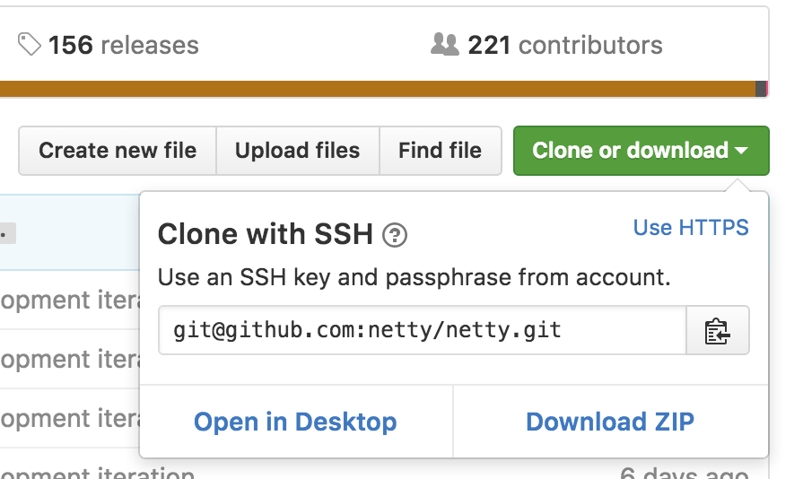
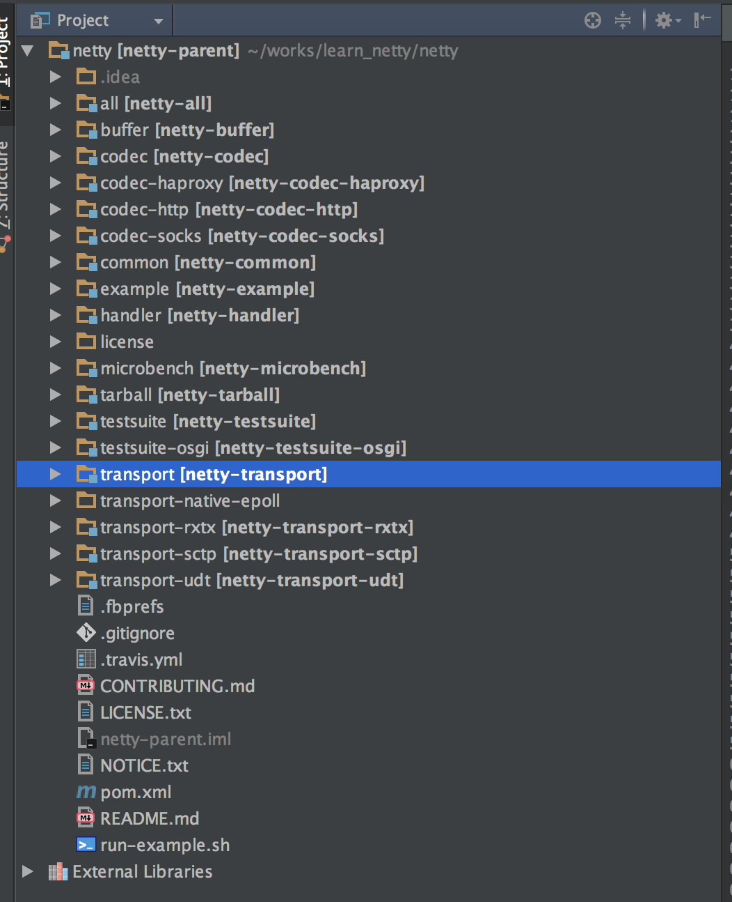
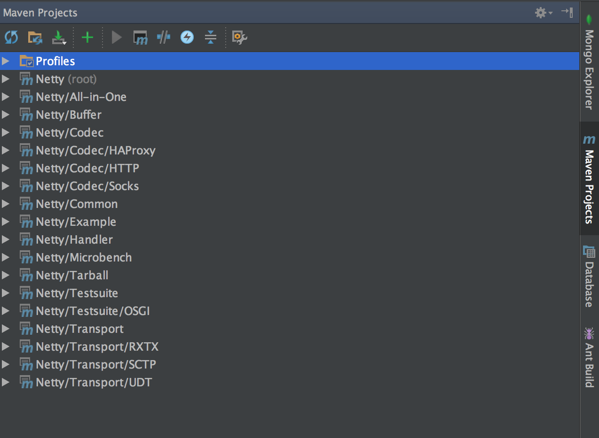
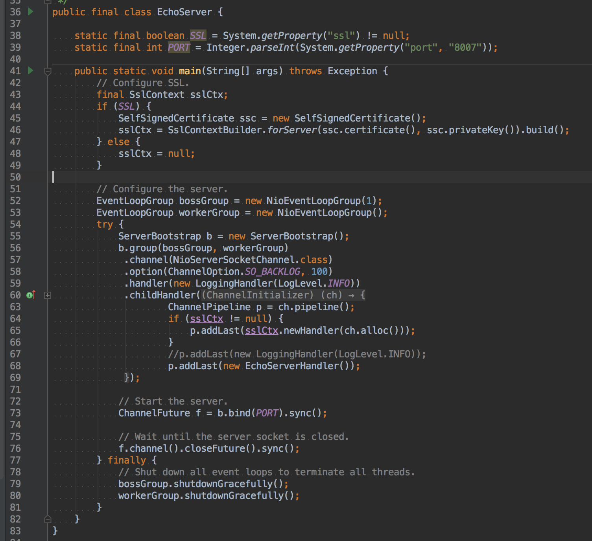

# Netty 源码分析之 零 磨刀不误砍柴工 源码分析环境搭建
@(Netty)[Java, Netty, Netty 源码分析, Bootstrap]
[TOC]


----------

## 代码下载
首先到 Netty 的 [Github 仓库](https://github.com/netty/netty) 中, 点击右边绿色的按钮:

拷贝 git 地址: git@github.com:netty/netty.git
然后在终端中输入如下命令, 克隆 Netty 工程:
```
/Users/xiongyongshun/works/learn_netty
>>> git clone git@github.com:netty/netty.git
Cloning into 'netty'...
```
Netty 工程源码较大, 加上国内网络问题, 下载 Netty 源码可能会比较耗时.
当有如下输出时, 表示克隆成功了:
```
/Users/xiongyongshun/works/learn_netty
>>> git clone git@github.com:netty/netty.git
Cloning into 'netty'...
remote: Counting objects: 210696, done.
remote: Compressing objects: 100% (93/93), done.
remote: Total 210696 (delta 33), reused 0 (delta 0), pack-reused 210587
Receiving objects: 100% (210696/210696), 40.38 MiB | 155.00 KiB/s, done.
Resolving deltas: 100% (93595/93595), done.
Checking connectivity... done.
```
如果有朋友实在下载太慢, 可以使用如下命令直接下载某个分支:
```
git clone -b netty-4.0.33.Final --single-branch git@github.com:netty/netty.git
```
当下载好后, 可以创建我们自己的一个分支, 用于代码的学习:
```
git checkout netty-4.0.33.Final
git checkout -b learn_netty_4.0.33
```
我们从 Netty 的 4.0.33.Final tag 中创建了自己的分支 **learn_netty_4.0.33**, 便于我们的源码的学习.

## IntelliJ IDEA 配置
用 IntelliJ IDEA 打开工程, 工程结构如下:

一般情况下, 此时我们就可以打开 example 目录, 运行下面的例子了.
不过有些读者可能会遇到 Maven 依赖下不全的问题, 此时我们可以点击右边的 Maven Project 标签, 然后点击蓝色的刷新按钮:
.

接下来我们可以运行 example 下的 EchoServer 看看:

如上图所示, 点击左边的绿色三角箭头即可运行了.