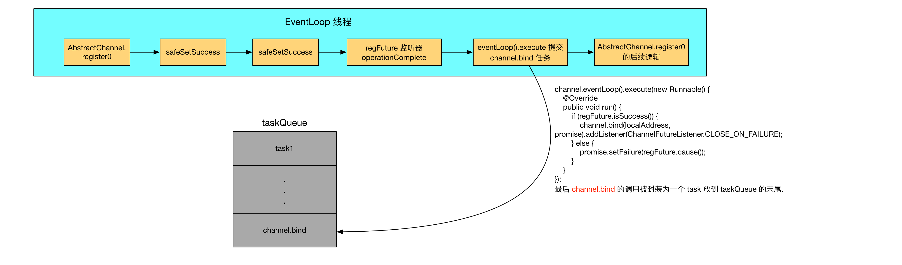

# 记一次有趣的 Netty 源码问题


[TOC]


----------

## 背景
起因是一个朋友问我的一个关于 [ServerBootstrap 启动的问题](http://stackoverflow.com/questions/40482830/is-there-a-possibility-that-pipeline-firechannelactive-is-executed-twice-when).
[相关 issue](https://github.com/yongshun/learn_netty_source_code/issues/1)

他的问题我复述一下:
ServerBootstrap 的绑定流程如下:
```java
ServerBootstrap.bind ->
	AbstractBootstrap.bind ->
		AbstractBootstrap.doBind ->
			AbstractBootstrap.initAndRegister ->
				AbstractChannel#AbstractUnsafe.register ->
					eventLoop.execute( () -> AbstractUnsafe.register0)
			doBind0() ->
				channel.eventLoop().execute( () -> channel.bind) ->
					AbstractUnsafe.bind
```
在 **AbstractUnsafe.register0** 中可能会调用 **pipeline.fireChannelActive()**, 即:
```java
private void register0(ChannelPromise promise) {
    try {
        ...
        boolean firstRegistration = neverRegistered;
        doRegister();
        ...
        if (firstRegistration && isActive()) {
            pipeline.fireChannelActive();
        }
    } catch (Throwable t) {
        ...
    }
}
```
并且在 **AbstractUnsafe.bind** 中也会有 **pipeline.fireChannelActive()** 的调用, 即:
```java
public final void bind(final SocketAddress localAddress, final ChannelPromise promise) {
    ...
    boolean wasActive = isActive();
    try {
        doBind(localAddress);
    } catch (Throwable t) {
        ...
    }

    if (!wasActive && isActive()) {
        invokeLater(new OneTimeTask() {
            @Override
            public void run() {
                pipeline.fireChannelActive();
            }
        });
    }
    ...
}
```

那么有没有可能造成了两次的 **pipeline.fireChannelActive()** 调用?

我的回答是不会. 为什么呢? 对于直接想知道答案的朋友可以直接阅读到最后面的 **回答** 与 **总结** 两节..

下面我们就来根据代码详细分析一下.
## 分析
首先, 根据我们上面所列出的调用流程, 会有 **AbstractBootstrap.doBind** 的调用, 它的代码如下:
```java
private ChannelFuture doBind(final SocketAddress localAddress) {
		// 步骤1
        final ChannelFuture regFuture = initAndRegister();
        ...
		// 步骤2
        if (regFuture.isDone()) {
            ...
            doBind0(regFuture, channel, localAddress, promise);
            ...
        } else {
            regFuture.addListener(new ChannelFutureListener() {
                @Override
                public void operationComplete(ChannelFuture future) throws Exception {
                    ...
                    doBind0(regFuture, channel, localAddress, promise);
                }
            });
        }
}
```
首先在 doBind 中, 执行步骤1, 即调用 **initAndRegister** 方法, 这个方法会最终调用到**AbstractChannel#AbstractUnsafe.register**. 而在 **AbstractChannel#AbstractUnsafe.register** 中, 会通过 eventLoop.execute 的形式将 AbstractUnsafe.register0 的调用提交到任务队列中(即提交到 eventLoop 线程中, 而当前代码所在的线程是 main 线程), 即:
```java
Override
public final void register(EventLoop eventLoop, final ChannelPromise promise) {
	// 当前线程是主线程, 因此这个判断是 false
    if (eventLoop.inEventLoop()) {
        register0(promise);
    } else {
        try {
            eventLoop.execute(new OneTimeTask() {
                @Override
                public void run() {
	                // register0 在 eventLoop 线程中执行.
                    register0(promise);
                }
            });
        } catch (Throwable t) {
           ...
        }
    }
}
```
接着 AbstractBootstrap.initAndRegister 返回, 回到 **AbstractBootstrap.doBind** 中, 于是执行到步骤2. 注意, 因为 **AbstractUnsafe.register0** 是在 **eventLoop** 中执行的, 因此有可能主线程执行到步骤2 时, **AbstractUnsafe.register0** 已经执行完毕了, 此时必然有 **regFuture.isDone() == true**; 但也有可能 **AbstractUnsafe.register0** 没有来得及执行, 因此此时 **regFuture.isDone() == false**. 所以上面的步骤2 考虑到了这两种情况, 因此分别针对这两种情况做了区分, 即:
```java
// 步骤2
if (regFuture.isDone()) {
    ...
    doBind0(regFuture, channel, localAddress, promise);
    ...
} else {
    regFuture.addListener(new ChannelFutureListener() {
        @Override
        public void operationComplete(ChannelFuture future) throws Exception {
            ...
            doBind0(regFuture, channel, localAddress, promise);
        }
    });
}
```

一般情况下, **regFuture.isDone()** 为 false, 因为绑定操作是比较费时的, 因此很大几率会执行到 else 分支, 并且 if 分支和 else 分支从结果上说没有不同, 而且 if 分支逻辑还更简单一些, 因此我们以 else 分支来分析吧. 在 else 分支中, 会为 **regFuture** 设置一个回调监听器. **regFuture** 是一个 `ChannelFuture`, 而 `ChannelFuture` 代表了一个 Channel 的异步 IO 的操作结果, 因此这里 `regFuture` 代表了 `Channel 注册(register)` 的这个异步 IO 的操作结果.
Netty 这里之所以要为 `regFuture` 设置一个回调监听器, 是为了保证 register 和 bind 的时序上的正确性: `Channel 的注册必须要发生在 Channel 的绑定之前`.
(关于时序的正确性的问题, 我们在后面有证明)


接下来我们来看一下 `AbstractUnsafe.register0` 方法:
```java
private void register0(ChannelPromise promise) {
    try {
		....
		// neverRegistered 一开始是 true, 因此 firstRegistration == true
        boolean firstRegistration = neverRegistered;
        doRegister();
        neverRegistered = false;
        registered = true;
        safeSetSuccess(promise);
        pipeline.fireChannelRegistered();
        // Only fire a channelActive if the channel has never been registered. This prevents firing
        // multiple channel actives if the channel is deregistered and re-registered.
        // firstRegistration == true, 而 isActive() == false, 
        // 因此不会执行到 pipeline.fireChannelActive()
        if (firstRegistration && isActive()) {
            pipeline.fireChannelActive();
        }
    } catch (Throwable t) {
        // Close the channel directly to avoid FD leak.
        closeForcibly();
        closeFuture.setClosed();
        safeSetFailure(promise, t);
    }
}
```
`注意, 我需要再强调一下, 这里 AbstractUnsafe.register0 是在 eventLoop 中执行的.`
AbstractUnsafe.register0 中会调用 **doRegister()** 注册 **NioServerSocketChannel**, 然后调用 **safeSetSuccess()**  设置 `promise` 的状态为成功. 而这个 `promise` 变量是什么呢? 我将 AbstractBootstrap.doBind 的调用链写详细一些:
```java
AbstractBootstrap.doBind ->
    AbstractBootstrap.initAndRegister ->
        MultithreadEventLoopGroup.register ->
            SingleThreadEventLoop.register -> 
                AbstractChannel#AbstractUnsafe.register ->
                    eventLoop.execute( () -> AbstractUnsafe.register0)
```
在 SingleThreadEventLoop.register 中会实例化一个 DefaultChannelPromise, 即:
```java
@Override
public ChannelFuture register(Channel channel) {
    return register(channel, new DefaultChannelPromise(channel, this));
}
```
接着调用重载的 SingleThreadEventLoop.register 方法:
```java
@Override
public ChannelFuture register(final Channel channel, final ChannelPromise promise) {
    if (channel == null) {
        throw new NullPointerException("channel");
    }
    if (promise == null) {
        throw new NullPointerException("promise");
    }

    channel.unsafe().register(this, promise);
    return promise;
}
```
我们看到, 实例化的 **DefaultChannelPromise** 最终会以方法返回值的方式返回到调用方, 即返回到 **AbstractBootstrap.doBind** 中:
```java
final ChannelFuture regFuture = initAndRegister();
```
因此我们这里有一个共识: regFuture 是一个在 **SingleThreadEventLoop.register** 中实例化的 `DefaultChannelPromise` 对象.


再回到 **SingleThreadEventLoop.register** 中, 在这里会调用 **channel.unsafe().register(this, promise)**, 将 promise 对象传递到 **AbstractChannel#AbstractUnsafe.register** 中, 因此在 **AbstractUnsafe.register0** 中的 `promise` 就是 **AbstractBootstrap.doBind** 中的 `regFuture`.
`promise == regFuture` 很关键.

既然我们已经确定了 `promise` 的身份, 那么调用的 **safeSetSuccess(promise);** 我们也知道是干嘛的了. **safeSetSuccess** 方法设置一个 Promise 的状态为`成功态`, 而 Promise 的 `成功态` 是最终状态, 即此时 `promise.isDone() == true`. 那么 设置 promise 为`成功态`后, 会发生什么呢?
还记得不 `promise == regFuture`, 而我们在 **AbstractBootstrap.doBind** 的 else 分支中设置了一个回调监听器:
```java
final PendingRegistrationPromise promise = new PendingRegistrationPromise(channel);
regFuture.addListener(new ChannelFutureListener() {
    @Override
    public void operationComplete(ChannelFuture future) throws Exception {
        Throwable cause = future.cause();
        if (cause != null) {
            // Registration on the EventLoop failed so fail the ChannelPromise directly to not cause an
            // IllegalStateException once we try to access the EventLoop of the Channel.
            promise.setFailure(cause);
        } else {
            // Registration was successful, so set the correct executor to use.
            // See https://github.com/netty/netty/issues/2586
            promise.executor = channel.eventLoop();
        }
        doBind0(regFuture, channel, localAddress, promise);
    }
});
```
因此当 **safeSetSuccess(promise);** 调用时, 根据 Netty 的 Promise/Future 机制, 会触发上面的 **operationComplete** 回调, 在回调中调用 `doBind0` 方法:
```java
private static void doBind0(
        final ChannelFuture regFuture, final Channel channel,
        final SocketAddress localAddress, final ChannelPromise promise) {
    // This method is invoked before channelRegistered() is triggered.  Give user handlers a chance to set up
    // the pipeline in its channelRegistered() implementation.
    channel.eventLoop().execute(new Runnable() {
        @Override
        public void run() {
            if (regFuture.isSuccess()) {
                channel.bind(localAddress, promise).addListener(ChannelFutureListener.CLOSE_ON_FAILURE);
            } else {
                promise.setFailure(regFuture.cause());
            }
        }
    });
}
```
`注意到, 有一个关键的地方, 代码中将 **channel.bind** 的调用放到了 eventLoop 中执行`. doBind0 返回后, 代码继续执行 `AbstractUnsafe.register0` 方法的剩余部分代码, 即:
```java
private void register0(ChannelPromise promise) {
    try {
		....
        safeSetSuccess(promise);
        // safeSetSuccess 返回后, 继续执行如下代码
        pipeline.fireChannelRegistered();
        // Only fire a channelActive if the channel has never been registered. This prevents firing
        // multiple channel actives if the channel is deregistered and re-registered.
        // firstRegistration == true, 而 isActive() == false, 
        // 因此不会执行到 pipeline.fireChannelActive()
        if (firstRegistration && isActive()) {
            pipeline.fireChannelActive();
        }
    } catch (Throwable t) {
        // Close the channel directly to avoid FD leak.
        closeForcibly();
        closeFuture.setClosed();
        safeSetFailure(promise, t);
    }
}
```

当 `AbstractUnsafe.register0` 方法执行完毕后, 才执行到 **channel.bind** 方法.


 而 **channel.bind** 方法最终会调用到 **AbstractChannel#AbstractUnsafe.bind** 方法, 源码如下:
```java
@Override
public final void bind(final SocketAddress localAddress, final ChannelPromise promise) {
    boolean wasActive = isActive();
    logger.info("---wasActive: {}---", wasActive);

    try {
	    // 调用 NioServerSocketChannel.bind 方法, 
	    // 将底层的 Java NIO SocketChannel 绑定到指定的端口.
		// 当 SocketChannel 绑定到端口后, isActive() 才为真.
        doBind(localAddress);
    } catch (Throwable t) {
        ...
    }

    boolean activeNow = isActive();
    logger.info("---activeNow: {}---", activeNow);

	// 这里 wasActive == false
	// isActive() == true
    if (!wasActive && isActive()) {
        invokeLater(new OneTimeTask() {
            @Override
            public void run() {
                pipeline.fireChannelActive();
            }
        });
    }

    safeSetSuccess(promise);
}
```
上面的代码中, 调用了 **doBind(localAddress)** 将底层的 Java NIO SocketChannel 绑定到指定的端口. 并且`当 SocketChannel 绑定到端口后, isActive() 才为真.`
因此我们知道, 如果 SocketChannel 第一次绑定时, 在调用 doBind 前, `wasActive == false == isActive()`, 而当调用了 **doBind** 后, `isActive() == true`, 因此第一次绑定端口时, if 判断成立, 会调用 **pipeline.fireChannelActive()**.

## 关于 Channel 注册与绑定的时序问题
我们在前的分析中, 直接认定了 `Channel 注册` 在 `Channel 的绑定` 之前完成, 那么依据是什么呢?
其实所有的关键在于 [EventLoop 的任务队列机制](https://segmentfault.com/a/1190000007403937#articleHeader4).
不要闲我啰嗦哦. 我们需要继续回到 `AbstractUnsafe.register0` 的调用中(再次强调一下, 在 eventLoop 线程中执行AbstractUnsafe.register0), 这个方法我们已经分析了, 它会调用 safeSetSuccess(promise), 并由 Netty 的 Promise/Future 机制, 导致了AbstractBootstrap.doBind 中的 regFuture 所设置的回调监听器的 `operationComplete` 方法调用, 而 `operationComplete` 中调用了 **AbstractBootstrap.doBind0**:
```java
private static void doBind0(
        final ChannelFuture regFuture, final Channel channel,
        final SocketAddress localAddress, final ChannelPromise promise) {
    channel.eventLoop().execute(new Runnable() {
        @Override
        public void run() {
            if (regFuture.isSuccess()) {
                channel.bind(localAddress, promise).addListener(ChannelFutureListener.CLOSE_ON_FAILURE);
            } else {
                promise.setFailure(regFuture.cause());
            }
        }
    });
}
```
在 **doBind0** 中, 根据 [EventLoop 的任务队列机制](https://segmentfault.com/a/1190000007403937#articleHeader4), 会使用 eventLoop().execute 将 **channel.bind** 封装为一个 Task, 放到 eventLoop 的 taskQueue 中.
如下用一幅图表示上面的过程:

而当 channel.bind 被调度时, `AbstractUnsafe.register0` 早就已经调用结束了.

因此由于 EventLoop 的任务队列机制, 我们知道, 在执行 AbstractUnsafe.register0 时, 是在 EventLoop 线程中的, 而 **channel.bind** 的调用是以 task 的形式添加到 taskQueue 队列的末尾, 因此必然是有 EventLoop 线程先执行完 **AbstractUnsafe.register0** 方法后, 才有机会从 taskQueue 中取出一个 task 来执行, 因此这个机制从根本上保证了 `Channel 注册发生在绑定` 之前.
## 回答
你的疑惑是, **AbstractChannel#AbstractUnsafe.register0** 中, 可能会调用 **pipeline.fireChannelActive()**, 即:
```java
private void register0(ChannelPromise promise) {
    try {
        ...
        boolean firstRegistration = neverRegistered;
        doRegister();
        ...
        if (firstRegistration && isActive()) {
            pipeline.fireChannelActive();
        }
    } catch (Throwable t) {
        ...
    }
}
```
并且在 **AbstractChannel#AbstractUnsafe.bind** 中也可能会调用到**pipeline.fireChannelActive()**, 即:
```java
public final void bind(final SocketAddress localAddress, final ChannelPromise promise) {
    ...
    boolean wasActive = isActive();
    try {
        doBind(localAddress);
    } catch (Throwable t) {
        ...
    }

    if (!wasActive && isActive()) {
        invokeLater(new OneTimeTask() {
            @Override
            public void run() {
                pipeline.fireChannelActive();
            }
        });
    }
    ...
}
```
我觉得是 `不会`. 因为根据上面我们分析的结果可知, Netty 的 Promise/Future 与 EventLoop 的任务队列机制保证了 NioServerSocketChannel 的注册和 Channel 的绑定的时序: `Channel 的注册必须要发生在 Channel 的绑定之前`, 而当一个 NioServerSocketChannel 没有绑定到具体的端口前, 它是`不活跃的(Inactive)`, 进而在 `register0` 中, **if (firstRegistration && isActive())** 就不成立, 因此就不会执行到 **pipeline.fireChannelActive()** 了.
而执行完注册操作后, 在 **AbstractChannel#AbstractUnsafe.bind** 才会调用**pipeline.fireChannelActive()**, 因此最终只有一次 fireChannelActive 调用.

## 总结
有两点需要注意的:
 - isActive() == true 成立的关键是此 NioServerSocketChannel 已经绑定到端口上了.
 - 由 Promise/Future 与 EventLoop 机制, 导致了 **Channel 的注册** 发生在 **Channel 的绑定** 之前, 因此在 **AbstractChannel#AbstractUnsafe.register0** 中的 isActive() == false, if 判断不成立, 最终就是 register0 中的 **pipeline.fireChannelActive()** 不会被调用.